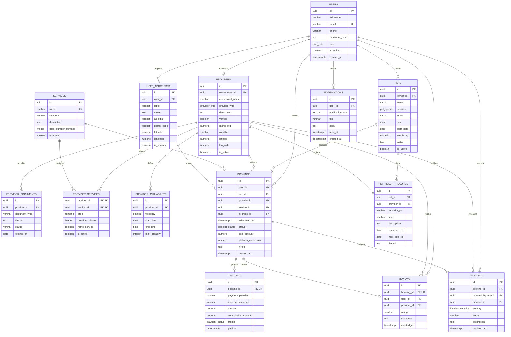

# Diagrama entidad-relación de Calli Pet

## Cardinalidades principales

- Un usuario puede registrar varias direcciones.
- Un tutor puede registrar varias mascotas.
- Una cuenta de proveedor administra un perfil de proveedor en el MVP.
- Un proveedor puede ofrecer varios servicios.
- Un servicio puede ser ofrecido por varios proveedores.
- Una reserva vincula a un tutor, una mascota, un proveedor y un servicio.
- Una reserva puede generar un pago y una evaluación.
- Una reserva puede originar varios incidentes.
- Una mascota puede tener múltiples registros en su expediente.
