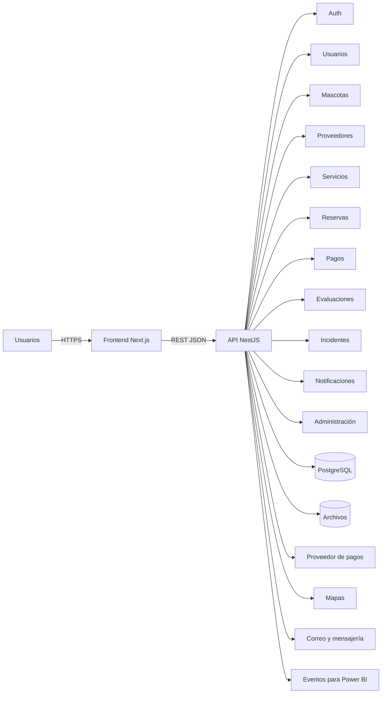

# Arquitectura web de Calli Pet

## Decisión

Calli Pet utilizará un monolito modular con:

- Frontend: Next.js, React y TypeScript.
- Backend: NestJS y TypeScript.
- API: REST documentada con OpenAPI.
- Base de datos: PostgreSQL.
- Archivos: almacenamiento compatible con S3.
- Integraciones: pagos, mapas, correo y mensajería.
- Analítica: eventos de negocio y Power BI.

## Diagrama

## Principios

1. Móvil primero.
2. Seguridad por diseño.
3. Autorización por rol y propiedad.
4. API versionada.
5. Accesibilidad WCAG 2.2 AA.
6. Escalamiento gradual.
7. Observabilidad.
8. Componentes reutilizables.

## Módulos

- Auth
- Users
- Pets
- Providers
- Services
- Availability
- Bookings
- Payments
- Reviews
- Incidents
- Notifications
- Admin
- Analytics
