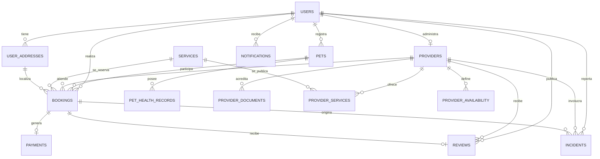

# Diagrama entidad-relación

```mermaid
erDiagram
    USERS ||--o{ USER_ADDRESSES : tiene
    USERS ||--o{ PETS : registra
    USERS ||--o| PROVIDERS : administra
    USERS ||--o{ BOOKINGS : realiza
    USERS ||--o{ REVIEWS : publica
    USERS ||--o{ INCIDENTS : reporta
    USERS ||--o{ NOTIFICATIONS : recibe

    PETS ||--o{ BOOKINGS : participa
    PETS ||--o{ PET_HEALTH_RECORDS : posee

    PROVIDERS ||--o{ PROVIDER_DOCUMENTS : acredita
    PROVIDERS ||--o{ PROVIDER_SERVICES : ofrece
    PROVIDERS ||--o{ PROVIDER_AVAILABILITY : define
    PROVIDERS ||--o{ BOOKINGS : atiende
    PROVIDERS ||--o{ REVIEWS : recibe
    PROVIDERS ||--o{ INCIDENTS : involucra

    SERVICES ||--o{ PROVIDER_SERVICES : se_publica
    SERVICES ||--o{ BOOKINGS : se_reserva

    USER_ADDRESSES ||--o{ BOOKINGS : localiza
    BOOKINGS ||--o| PAYMENTS : genera
    BOOKINGS ||--o| REVIEWS : recibe
    BOOKINGS ||--o{ INCIDENTS : origina
```
