# Mapa del sitio

```mermaid
flowchart TD
    HOME[Inicio]

    HOME --> PUB[Área pública]
    HOME --> AUTH[Acceso]
    HOME --> TUTOR[Panel tutor]
    HOME --> PROVIDER[Panel proveedor]
    HOME --> ADMIN[Administración]

    PUB --> SERVICES[Servicios]
    PUB --> SEARCH[Buscar proveedores]
    PUB --> PROFILE[Perfil de proveedor]
    PUB --> HOW[Cómo funciona]
    PUB --> HELP[Ayuda]
    PUB --> LEGAL[Legal]

    AUTH --> LOGIN[Iniciar sesión]
    AUTH --> REGISTER[Registro]

    TUTOR --> PETS[Mascotas]
    TUTOR --> BOOKINGS[Reservas]
    TUTOR --> PAYMENTS[Pagos]
    TUTOR --> RECORDS[Expediente]
    TUTOR --> SETTINGS[Configuración]

    PROVIDER --> PPROFILE[Perfil comercial]
    PROVIDER --> PSERVICES[Servicios y precios]
    PROVIDER --> AVAILABILITY[Disponibilidad]
    PROVIDER --> AGENDA[Agenda]
    PROVIDER --> REVENUE[Ingresos]
    PROVIDER --> DOCUMENTS[Documentos]

    ADMIN --> VALIDATION[Validaciones]
    ADMIN --> INCIDENTS[Incidentes]
    ADMIN --> REPORTS[Reportes]
    ADMIN --> CATALOGS[Catálogos]
```



## Rutas

```text
/
/servicios
/proveedores
/proveedores/[id]
/como-funciona
/para-proveedores
/ayuda
/legal/terminos
/legal/privacidad
/login
/registro
/app
/app/mascotas
/app/mascotas/[id]
/app/buscar
/app/reservas
/app/reservas/[id]
/app/pagos
/app/configuracion
/provider
/provider/perfil
/provider/servicios
/provider/disponibilidad
/provider/agenda
/provider/ingresos
/provider/documentos
/admin
/admin/proveedores
/admin/validaciones
/admin/incidentes
/admin/reportes
```
